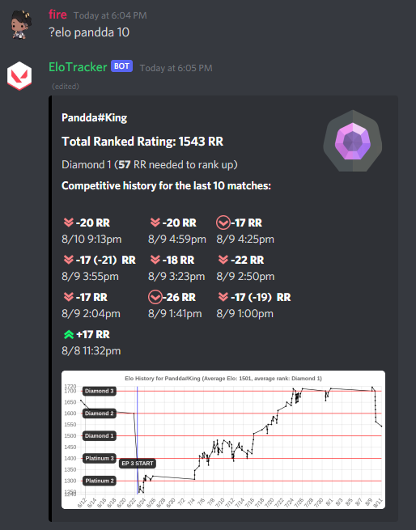
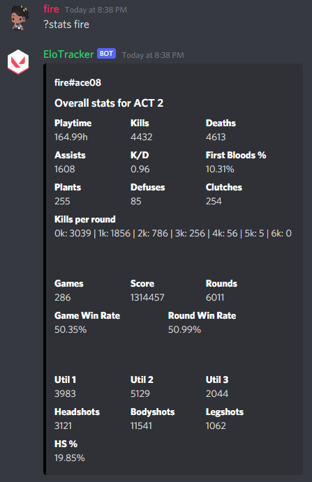
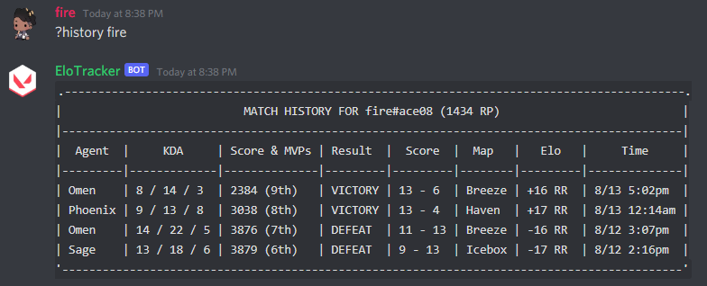
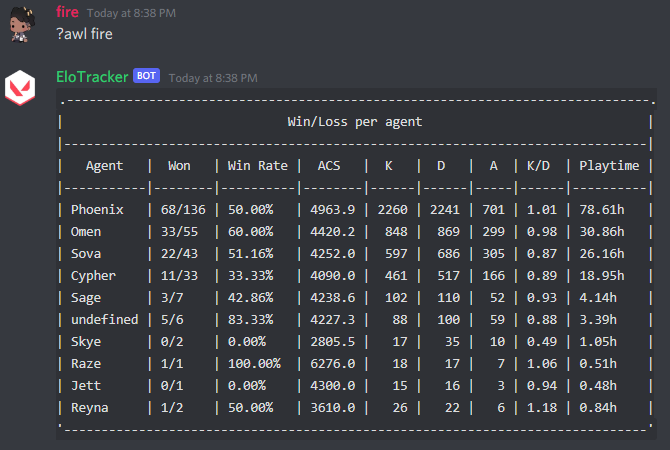

# Elo Tracker
Discord bot to track Valorant matches and elo over time. Offers comprehensive graphs and statistics for matches played.

# Features
## Elo Graph
Get the latest matches of a user and show a graph showing their Elo changes over time.

## Stats
Show the playtime, KDA, plants, games, win rate, HS %, and other stats for a player.

## Match History
Show a table for the latest competitive matches of the player.

## Agent Win Loss
Show the game win rate, playtime, and KD per agent.

## Store
Show the current store of the player (requires user credentials to be stored).

# Tracking
Every hour, the latest match data for the current list of users added to the bot will be downloaded. Once downloaded, the statistics will be computer based on the specified time range. This means all match data must be downloaded continuously. Old matches from before the bot is run will not be retrieved. 

# Disclaimer
This bot is not meant to be downloaded and run. It is here for archival purposes. If you would like to run it yourself, setup is required for sensitive files for which the code should be able to explain.
